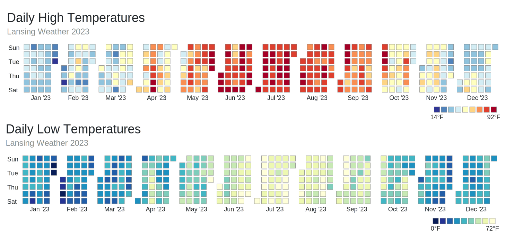

# Calendar Heatmap

> Generate a Calendar Heatmap from a date - value data source (csv, json)



Visit <https://kuhlgert.com/calendar-heatmap/> to generate a calendar heatmap from a given dataset.

## Install

The installation requires you to have Node.js and NPM installed. After that run the command below to install the application.

```bash
npm install
```

## Start the Application

Run the command below to start the application.

```bash
npm start
```

## Use the Library

In case you want to use the library in your own app, find the available functions below. The HTML output of settings, presets, and references uses the classes compatible with [Bootstrap 5.x](https://getboostrap.com).

### The HTML file

```html
<!-- HTML File -->
<html>
  ...
  <body>
    <div id="svg"></div>
  </body>
  ...
</html>
```

### The JavaScript File

```JavaScript
// Initiate
const calendarheatmap = new CalendarHeatmap();

// Return the SVG and add to element
document.querySelector("#svg").innerHTML = calendarheatmap.build();

// Get the Settings Object
calendarheatmap.settings();

// Get the Settings as HTML
calendarheatmap.settingsHTML();

// Get the Presets as Object
calendarheatmap.presets();

// Get the Presets as HTML
calendarheatmap.presetsHTML();

// Reset Settings
calendarheatmap.reset();

// Update Settings
calendarheatmap.update(calendarheatmap.getPreset(event.target.value));
```
